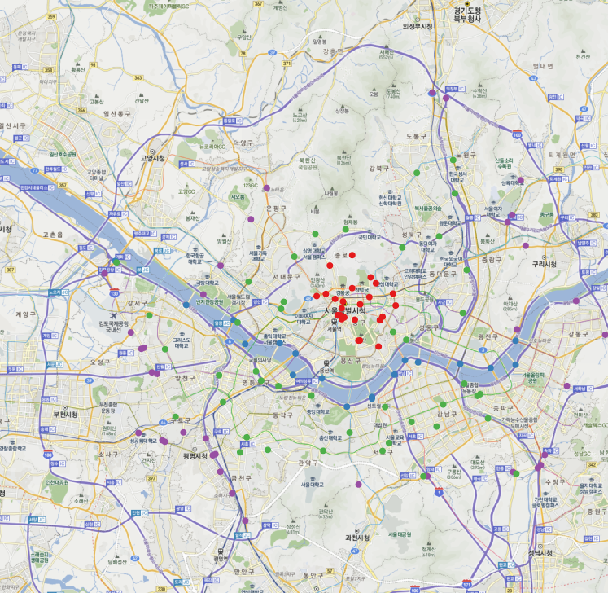

DaumMap
=======
R functions for using Daum Map tiles


### An example

```coffee
require(rgdal)
require(png)
require(RgoogleMaps)
require(RColorBrewer)

# load location of traffic counting data in Seoul
library(RCurl)       
gitaddress <- "https://raw.githubusercontent.com/dongikjang/DaumMap/"
TCountingLocInSeoul <- getURL(paste(gitaddress, "master/TCountingLocInSeoul.csv", sep=""),
  		                        cainfo = system.file("CurlSSL", "cacert.pem", package = "RCurl"))
#write(TCountingLocInSeoul, file="TCountingLocInSeoul.csv")
tloc <- read.csv(textConnection(TCountingLocInSeoul), stringsAsFactors = FALSE,
                 fileEncoding = "UTF-8")
                 
lon <- tloc$X5
lat <- tloc$X6

# download Daum Map tiles
dmap <- getDaumMap(lon, lat, zoom=NA)
cols <- brewer.pal(9, "Set1")
plot(dmap)
daumloc <- WGS842Daum(tloc[ , c("X5", "X6")])
points(daumloc,  pch=19, col=cols[tloc$X2])
```

