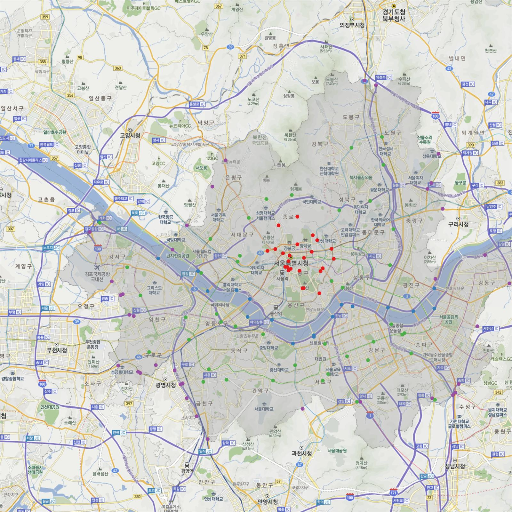

DaumMap
=======
R functions for using Daum Map tiles

## Load the source code for using Daum Map tiles

```r
gitaddress <- "https://raw.githubusercontent.com/dongikjang/DaumMap/"

# load the source code
library(RCurl)

u <- paste(gitaddress, "master/getDaummap.R", sep="")
eval(parse(text = getURL(u, followlocation = TRUE, 
                         cainfo = system.file("CurlSSL", "cacert.pem", 
                                              package = "RCurl"))), 
     envir = .GlobalEnv)
     
download.file.Bin <- function(url, destfile, encoding="UTF-8"){
  require(RCurl)
  binfile <- getBinaryURL(url, encoding=encoding,
                          cainfo = system.file("CurlSSL", "cacert.pem", 
                                               package = "RCurl"))
  con <- file(destfile, open = "wb")
  writeBin(binfile, con)
  close(con)
}            
```

## An example

#### Load required libraries
```r
library(rgdal)
library(png)
library(jpeg)
library(RgoogleMaps)
library(RColorBrewer)
library(RCurl)
library(maptools)
library(scales)
```

#### Download and load locations of traffic counting data in Seoul
```r
TCLoc <- getURL(paste(gitaddress, "master/TCountingLocInSeoul.csv", sep=""),
                cainfo = system.file("CurlSSL", "cacert.pem", package = "RCurl"))
#write(TCLoc, file="TCountingLocInSeoul.csv")
tloc <- read.csv(textConnection(TCLoc), stringsAsFactors = FALSE,
                 fileEncoding = "UTF-8")
                 
lon <- tloc$X5
lat <- tloc$X6
```

#### Download and load administrative area shpfile of Seoul
```r
dir.create("shpfile")
download.file.Bin(paste(gitaddress, "master/shpfile/Seoul.shp", sep=""),
                  "shpfile/Seoul.shp")
download.file.Bin(paste(gitaddress, "master/shpfile/Seoul.dbf", sep=""),
                  "shpfile/Seoul.dbf")
download.file.Bin(paste(gitaddress, "master/shpfile/Seoul.shx", sep=""),
                  "shpfile/Seoul.shx")
proj4val <- "+proj=tmerc +lat_0=38 +lon_0=127.0028902777778 +k=1 
             +x_0=200000 +y_0=500000 +ellps=bessel 
             +units=m +no_defs 
             +towgs84=-115.80,474.99,674.11,1.16,-2.31,-1.63,6.43"
seoulwgs <- readShapePoly("shpfile/Seoul.shp", proj4string=CRS(proj4val))
```
### Download Daum Map tiles
```r
dmap <- getDaumMap(lon, lat, zoom=NA, mapstyle="Hybrid")
# Select the map style among "Hybrid", "Physical", "Satellite" and "Street".
# Default is "Hybrid".
```
#### Plot 
```r
cols <- brewer.pal(9, "Set1")
plot(dmap)
seouldaum <- spTransform(seoulwgs, dmap$proj4)
plot(seouldaum, col=alpha(cols[9], .3), lwd=.1, border=1, add=T)
daumloc <- WGS842Daum(tloc[ , c("X5", "X6")])
points(daumloc,  pch=19, col=cols[tloc$X2])
```


